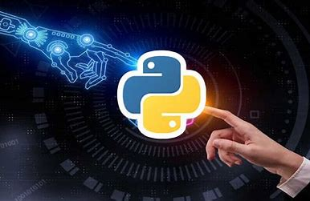

# IA_Tester_Proyect

This code can be used to test if the logic of a code has changed with respect to its update. This can be very useful for developers to make sure that they have not made any mistakes in optimizing the code with respect to the original.

## ¿How it works?
- This script generate multiple random json inputs adjusted to the input of both codes that we are going to compare.
- Then for each input generated (1000 more or less, is adjustable), the script execute with each input both codes and compare de output, trying to find some variations on the output.
- If the script find's some variation it will stop and explain witch is the variation.   

## ¿Purpose?
The purpose of this script is to find if an upgrade of *only* optimisation have different logic than the original version.

## ¿How to use it?
1. The first thing is that this code will not be usefull for all of us, because the input json that is generated with random values, are adjusted for de input data of both codes that I'm testing. You must adjust to out requirements.
2. The second thing is that you must change both codes on folder test (logic), with your own codes to be tested.
