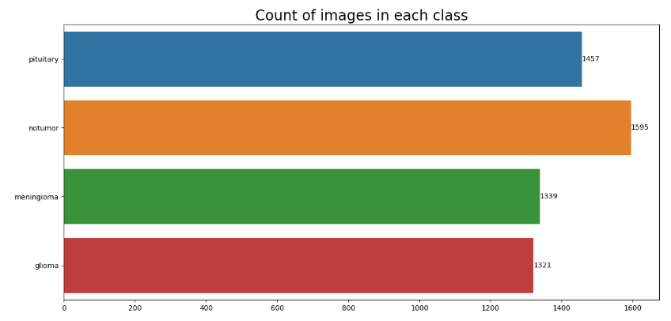

This is a proyect that I realize in the process of training for my TFG, and I think it may be useful for someone. However, is so
difficult to obtain an MRI image of your brain by your self, but that's why it is designed for medical institutions use.


## ¿Questions?
### ¿Where I find the dataset?
In process of information research I found a lot of platforms that offers by free MRI Tumor datasets of whatever part of the human body. However,
it is curious because in the recent past I always thought that distribute medical images of patients are illegal, but nowadays it seems that it is not, as 
they are doing it with the purpose of advancing the process of cancer resolutions, for which I am grateful.

Without going into further detail, the dataset I use for this IA is form -> https://www.kaggle.com/datasets/masoudnickparvar/brain-tumor-mri-dataset

I choosed this dataset because is categoriced by four types of tumor:
- glioma
- meningioma
- pituitary
- notumor

I know that there are a lot of types of brain tumor (more than 4), and it is why I use this dataset because my Neuronal Network can support more than 70 different categories whithout any problem, obviously adjusting the code for it.

Here is a graphical representation of the dataset:


### ¿How it works?
The principal program is **all based on python** and it is contained on a ``.ipnyb`` file which is a `jupiter notebook` format that can improve the understanding of the program, and its escalability.

### ¿What dependecies do the program use?
For this kind of proyects I always work with `python virtual envs` because it always has a problem with a specific dependecy or something like that. It is basically to prevent future conflicts of dependecies.

So in the repository I let a ``requirements.txt`` where you only need to do:
```Bash
pip install -r requirements.txt 
```

and that's all, I hope would be usefull :) !!